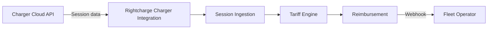

Fleet operators using your charger hardware can offer drivers accurate, policy-controlled home charging reimbursement without building additional infrastructure. This blueprint shows how to connect your charger cloud API to Rightcharge for session ingestion, tariff calculation, and reimbursement.

## Target outcome

Your charger hardware supports fleet home charging reimbursement out of the box. Fleet operators configure the programme through Rightcharge, and session data flows directly from your charger cloud API.

## What you own

- Charger hardware and firmware
- Cloud API for session and device data
- Installer network
- [PLACEHOLDER: API rate limits and authentication model]

## What Rightcharge provides

- Charger Integration: direct manufacturer API connection
- Session Ingestion: processes and stores session data
- Tariff Engine: electricity cost calculation
- Eligibility & Policy: qualification and fraud controls
- Reimbursement: payment calculation and records
- Driver Onboarding: hosted journeys if needed

## Required and optional modules

| Module | Required | Notes |
| --- | --- | --- |
| Charger Integration | Yes | Direct manufacturer API |
| Session Ingestion | Yes | Processes charger data |
| Tariff Engine | Yes | Cost calculation |
| Reimbursement | Yes | Payment records |
| Driver Onboarding | Optional | If fleet operator lacks driver management |
| Eligibility & Policy | Optional | Fraud controls and rules |
| Vehicle Integration | Optional | VIN-matched attribution |

## Architecture

Your charger cloud API sends session data to Rightcharge Charger Integration. Session Ingestion stores and validates the data. The Tariff Engine calculates cost, and Reimbursement produces a payment record. Webhooks notify the fleet operator.

## User journey

<Steps>
  <Step title="Fleet operator selects your charger">
    The fleet operator installs your charger for the driver.
  </Step>
  <Step title="Driver onboarded">
    The driver completes onboarding, linking their charger and tariff.
  </Step>
  <Step title="Driver charges at home">
    The driver plugs in. Your charger records the session.
  </Step>
  <Step title="Session sent to Rightcharge">
    Your charger cloud API pushes the session data to Rightcharge.
  </Step>
  <Step title="Cost calculated">
    The Tariff Engine applies the driver's tariff and computes the electricity cost.
  </Step>
  <Step title="Reimbursement generated">
    Reimbursement creates a payment record. The fleet operator receives a webhook.
  </Step>
</Steps>

## Required APIs and webhooks

| Purpose | Type | Details |
| --- | --- | --- |
| Push session data | API | [PLACEHOLDER: endpoint path for charger session submission] |
| Device registration | API | [PLACEHOLDER: endpoint path for charger registration] |
| Reimbursement status | Webhook | [PLACEHOLDER: reimbursement status event name] |
| Session validation result | Webhook | [PLACEHOLDER: session validation event name] |

## Failure and recovery paths

<Accordion title="Session data incomplete">
  If the session payload lacks required fields, Rightcharge returns a validation error. Your API should retry after correcting the payload.
</Accordion>

<Accordion title="Charger offline">
  If the charger cannot reach your cloud API, sessions are queued locally. Your cloud API should batch-send queued sessions once connectivity resumes.
</Accordion>

<Accordion title="Tariff not found">
  If the driver's tariff is missing, the session is held pending. The fleet operator or driver must update the tariff record before calculation proceeds.
</Accordion>

<Accordion title="Webhook delivery fails">
  If the fleet operator's webhook endpoint is down, Rightcharge retries. [PLACEHOLDER: retry count and interval]
</Accordion>

## Sandbox acceptance criteria

- [ ] Charger registration API succeeds
- [ ] Session push API accepts a valid payload
- [ ] Session data is retrievable via Rightcharge API
- [ ] Tariff Engine returns a cost for the test session
- [ ] Reimbursement record created
- [ ] Webhooks received and acknowledged

## Go-live checklist

- [ ] Production API credentials generated
- [ ] Webhook endpoints registered for fleet operators
- [ ] Charger firmware validated for session accuracy
- [ ] Cloud API rate limits documented
- [ ] Error monitoring for session push failures
- [ ] Installer network briefed on onboarding requirements
- [ ] Support escalation path agreed with Rightcharge
