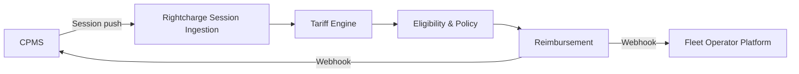

Fleet operators using your charge point management system (CPMS) can offer drivers home charging reimbursement with tariff-accurate costing. This blueprint shows how to connect your CPMS to Rightcharge so session data flows into eligibility checks, tariff calculations, and reimbursement events.

## Target outcome

Fleet operators on your CPMS can launch a home charging reimbursement programme without building their own tariff or reimbursement infrastructure. Drivers charge at home, sessions are pushed from your CPMS, and Rightcharge calculates what the fleet operator owes.

## What you own

- CPMS platform and session data
- Fleet operator relationships
- Charger estate management
- [PLACEHOLDER: API credentials and rate limit management]

## What Rightcharge provides

- Tariff Engine: electricity cost calculation from real tariff data
- Eligibility & Policy: fraud controls and qualification rules
- Reimbursement: calculation engine and payment records
- Driver Onboarding: hosted journeys if your CPMS does not already manage drivers
- Webhooks: lifecycle events for reimbursements and status changes

## Required and optional modules

| Module | Required | Notes |
| --- | --- | --- |
| Session Ingestion | Yes | CPMS push model |
| Tariff Engine | Yes | Calculates cost per session |
| Eligibility & Policy | Yes | Qualification and fraud controls |
| Reimbursement | Yes | Payment calculation and records |
| Driver Onboarding | Optional | Use if CPMS lacks driver management |
| Vehicle Integration | Optional | VIN-matched session attribution |

## Architecture

Your CPMS pushes session data to Rightcharge Session Ingestion. The Tariff Engine calculates cost, Eligibility & Policy applies rules, and Reimbursement produces a payment record. Webhooks notify both your CPMS and the fleet operator platform.

## User journey

<Steps>
  <Step title="Fleet operator enables reimbursement">
    The fleet operator configures reimbursement policy in your CPMS or via Rightcharge.
  </Step>
  <Step title="Driver charges at home">
    The driver plugs in at home. Your CPMS records the session.
  </Step>
  <Step title="CPMS pushes session">
    Your system sends the session payload to Rightcharge Session Ingestion.
  </Step>
  <Step title="Rightcharge calculates cost">
    The Tariff Engine looks up the driver's tariff and computes the electricity cost.
  </Step>
  <Step title="Eligibility check">
    Eligibility & Policy verifies the session qualifies under the fleet operator's rules.
  </Step>
  <Step title="Reimbursement created">
    Reimbursement generates a payment record. A webhook notifies your CPMS and the fleet operator.
  </Step>
  <Step title="Fleet operator pays driver">
    The fleet operator pays the driver or supplier via their own payment rails.
  </Step>
</Steps>

## Required APIs and webhooks

| Purpose | Type | Details |
| --- | --- | --- |
| Push session | API | [PLACEHOLDER: endpoint path for session submission] |
| Receive reimbursement status | Webhook | [PLACEHOLDER: reimbursement status event name] |
| Receive eligibility result | Webhook | [PLACEHOLDER: eligibility result event name] |
| Fleet operator notification | Webhook | [PLACEHOLDER: fleet operator event name] |

## Failure and recovery paths

<Accordion title="Session push fails">
  If the session push returns an error, retry with exponential backoff. Rightcharge supports idempotency keys. [PLACEHOLDER: retry policy details]
</Accordion>

<Accordion title="Tariff lookup missing">
  If the driver's tariff is not found, the session is held in a pending state. Your system or the fleet operator must supply the tariff before calculation proceeds.
</Accordion>

<Accordion title="Eligibility rejects session">
  If the session fails eligibility, a webhook is sent with the rejection reason. The session is excluded from reimbursement. The fleet operator can review and override if policy allows.
</Accordion>

<Accordion title="Webhook delivery fails">
  If a webhook is not acknowledged, Rightcharge retries. [PLACEHOLDER: retry count and interval]
</Accordion>

## Sandbox acceptance criteria

- [ ] Session push API responds with success for a valid payload
- [ ] Tariff Engine returns a non-zero cost for a known tariff
- [ ] Eligibility & Policy accepts a valid home charging session
- [ ] Reimbursement record is created and retrievable via API
- [ ] Webhooks are received and acknowledged by your endpoint
- [ ] Idempotency key prevents duplicate session creation

## Go-live checklist

- [ ] Production API credentials generated
- [ ] Webhook endpoints registered and verified
- [ ] Fleet operators configured with reimbursement policies
- [ ] Tariff data available for all driver regions
- [ ] Error monitoring and alerting in place for session push failures
- [ ] Runbook for manual session correction documented
- [ ] Support escalation path agreed with Rightcharge
