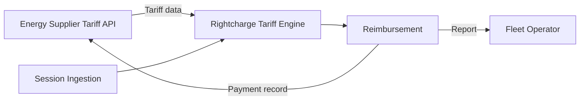

Fleet operators on your tariff can receive accurate, supplier-verified reimbursement. This blueprint shows how to integrate your tariff data into Rightcharge so that session costs are calculated from your real tariff structures. You can also participate in direct supplier-to-fleet billing, which is currently available on a limited availability basis.

## Target outcome

Fleet operators using your tariff receive reimbursement amounts that reflect your actual tariff rates. Optionally, you can receive direct payment records for fleet charging, reducing the reimbursement burden on the fleet operator.

## What you own

- Tariff data and updates
- Billing infrastructure
- Customer accounts
- [PLACEHOLDER: tariff API specification and update frequency]

## What Rightcharge provides

- Tariff Engine: integrates your tariff data into cost calculations
- Driver Onboarding: hosted journeys for tariff selection
- Session Ingestion: accepts session data from any source
- Reimbursement: payment calculation and records
- Energy Payments: direct supplier-to-fleet billing (limited availability)

<Info>
  Supplier tariff integration requires a data agreement with Rightcharge. Contact [partners@rightcharge.co.uk](mailto:partners@rightcharge.co.uk).
</Info>

## Required and optional modules

| Module | Required | Notes |
| --- | --- | --- |
| Tariff Engine | Yes | Supplier tariff integration |
| Session Ingestion | Yes | Accepts session data |
| Reimbursement | Yes | Payment records |
| Driver Onboarding | Optional | Hosted journey for tariff selection |
| Eligibility & Policy | Optional | Rules engine |
| Energy Payments | Optional | Direct supplier-to-fleet billing (limited availability) |

## Architecture

Your tariff API supplies tariff data to the Rightcharge Tariff Engine. Session Ingestion feeds session data into the same engine. Reimbursement produces reports for the fleet operator and, if Energy Payments is enabled, payment records for you.

## User journey

<Steps>
  <Step title="Fleet operator selects your tariff">
    The fleet operator or driver chooses your tariff during onboarding.
  </Step>
  <Step title="Tariff data synced">
    Rightcharge pulls or receives tariff data from your API.
  </Step>
  <Step title="Driver charges at home">
    The driver plugs in. Session data is sent to Rightcharge.
  </Step>
  <Step title="Cost calculated from your tariff">
    The Tariff Engine uses your tariff data to compute the exact electricity cost.
  </Step>
  <Step title="Reimbursement generated">
    A reimbursement record is created. If Energy Payments is enabled, a payment record is also sent to you.
  </Step>
</Steps>

## Required APIs and webhooks

| Purpose | Type | Details |
| --- | --- | --- |
| Supply tariff data | API | [PLACEHOLDER: endpoint path or data feed for tariff submission] |
| Receive payment record | Webhook | [PLACEHOLDER: payment record event name] |
| Tariff update notification | Webhook | [PLACEHOLDER: tariff update event name] |

## Failure and recovery paths

<Accordion title="Tariff data stale">
  If your tariff data is not updated in time for a session calculation, the Tariff Engine may use the last known rates or flag the session as pending. Maintain a regular sync schedule.
</Accordion>

<Accordion title="Tariff API unavailable">
  If your tariff API is down, Rightcharge caches recent tariff data. [PLACEHOLDER: cache duration and fallback behaviour]
</Accordion>

<Accordion title="Session missing tariff match">
  If the session cannot be matched to a known tariff, it is held pending. The fleet operator or driver must update the tariff record.
</Accordion>

<Accordion title="Webhook delivery fails">
  If your webhook endpoint is unavailable, Rightcharge retries. [PLACEHOLDER: retry count and interval]
</Accordion>

## Sandbox acceptance criteria

- [ ] Tariff data API accepts a valid tariff payload
- [ ] Tariff Engine returns a cost using your tariff data
- [ ] Session ingestion accepts a test session
- [ ] Reimbursement record created with accurate tariff-based cost
- [ ] Webhooks received and acknowledged
- [ ] Energy Payments flow tested if applicable

## Go-live checklist

- [ ] Production API credentials generated
- [ ] Data agreement signed with Rightcharge
- [ ] Tariff update schedule agreed and documented
- [ ] Webhook endpoints registered and verified
- [ ] Error monitoring for tariff sync failures
- [ ] Support escalation path agreed with Rightcharge
