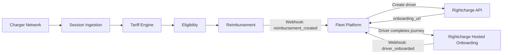

Fleet managers using your platform can enrol drivers, track home charging costs, and process reimbursements without leaving your UI. This blueprint shows how to embed Rightcharge modules into your fleet management platform using hosted onboarding journeys and lifecycle webhooks.

## Target outcome

Your fleet platform offers a complete home charging reimbursement feature. Fleet managers enrol drivers through a branded journey, sessions arrive from any charger source, and reimbursement events feed back into your reporting dashboard.

## What you own

- Fleet management UI and reporting dashboard
- Driver records and fleet configuration
- Payment execution
- [PLACEHOLDER: webhook endpoint infrastructure]

## What Rightcharge provides

- Driver Onboarding: hosted, brandable journeys
- Charger and Vehicle Integration: connects to external data sources
- Tariff Engine: cost calculation from real tariff data
- Eligibility & Policy: qualification and fraud controls
- Reimbursement: calculation engine and payment records
- Webhooks: driver onboarding, session status, reimbursement lifecycle

## Required and optional modules

| Module | Required | Notes |
| --- | --- | --- |
| Driver Onboarding | Yes | Hosted journey |
| Session Ingestion | Yes | Accepts multiple sources |
| Tariff Engine | Yes | Cost calculation |
| Eligibility & Policy | Yes | Rules engine |
| Reimbursement | Yes | Payment records |
| Vehicle Integration | Optional | VIN-matched attribution |
| Webhooks | Optional | Reporting triggers |

## Architecture

Your platform creates a driver via the Rightcharge API and receives an onboarding URL. The driver completes the hosted journey. Charger networks push sessions to Session Ingestion. The Tariff Engine, Eligibility, and Reimbursement modules process the session, and webhooks update your platform.

## User journey

<Steps>
  <Step title="Fleet manager adds driver">
    The fleet manager adds a driver in your platform. Your backend calls the Rightcharge API to create the driver record.
  </Step>
  <Step title="Driver receives onboarding link">
    Your platform sends the driver the onboarding URL returned by Rightcharge.
  </Step>
  <Step title="Driver completes onboarding">
    The driver enters their home charger, vehicle, and tariff details in the hosted journey.
  </Step>
  <Step title="Platform notified">
    Rightcharge sends a webhook when onboarding completes. Your platform marks the driver as active.
  </Step>
  <Step title="Driver charges at home">
    The driver plugs in. The charger network sends the session to Rightcharge.
  </Step>
  <Step title="Cost calculated and checked">
    Rightcharge applies the tariff and eligibility rules.
  </Step>
  <Step title="Reimbursement created">
    A reimbursement record is generated. Your platform receives a webhook and updates the fleet manager's dashboard.
  </Step>
</Steps>

## Required APIs and webhooks

| Purpose | Type | Details |
| --- | --- | --- |
| Create driver | API | [PLACEHOLDER: endpoint path for driver creation] |
| Receive onboarding URL | API | [PLACEHOLDER: response field for onboarding_url] |
| Onboarding completed | Webhook | [PLACEHOLDER: driver onboarded event name] |
| Reimbursement created | Webhook | [PLACEHOLDER: reimbursement created event name] |
| Session status | Webhook | [PLACEHOLDER: session status event name] |

## Failure and recovery paths

<Accordion title="Onboarding link expires">
  If the driver does not complete onboarding within the expiry window, your platform requests a new onboarding URL from Rightcharge.
</Accordion>

<Accordion title="Webhook not delivered">
  If your webhook endpoint is unavailable, Rightcharge retries. [PLACEHOLDER: retry count and interval] Monitor your endpoint health to avoid stale dashboard data.
</Accordion>

<Accordion title="Driver onboarding rejected">
  If eligibility rules reject the driver during onboarding, a webhook is sent with the rejection reason. Your platform can surface this to the fleet manager.
</Accordion>

<Accordion title="Session missing tariff">
  If the driver's tariff is not yet configured, the session is held pending. Your platform can prompt the driver to complete tariff setup.
</Accordion>

## Sandbox acceptance criteria

- [ ] Driver creation API returns a valid onboarding URL
- [ ] Hosted onboarding journey completes successfully
- [ ] Webhook received when driver onboarding completes
- [ ] Session ingestion accepts a test session
- [ ] Tariff Engine returns a cost for the test session
- [ ] Reimbursement record created and webhook received

## Go-live checklist

- [ ] Production API credentials generated
- [ ] Webhook endpoints registered and verified
- [ ] Hosted journey branding configured
- [ ] Fleet operator roles and permissions mapped
- [ ] Error monitoring for webhook delivery
- [ ] Dashboard displays reimbursement status accurately
- [ ] Support escalation path agreed with Rightcharge
