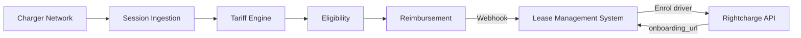

EV lease customers can receive home charging reimbursement as part of their lease package, with accurate tariff-based costing. This blueprint shows how to connect your lease management system to Rightcharge for driver enrolment, session processing, and reimbursement reporting.

## Target outcome

Your lease product includes home charging reimbursement. Drivers are enrolled automatically when they take delivery of the vehicle, and reimbursement reports feed into your lease billing cycle.

## What you own

- Lease management system
- Driver and vehicle records
- Payment processing
- [PLACEHOLDER: billing cycle integration points]

## What Rightcharge provides

- Driver Onboarding: hosted journeys for lease customers
- Charger Integration: connects to charger networks
- Tariff Engine: electricity cost calculation
- Eligibility & Policy: qualification and fraud controls
- Reimbursement: calculation engine and payment records

## Required and optional modules

| Module | Required | Notes |
| --- | --- | --- |
| Driver Onboarding | Yes | Hosted journey for lease customers |
| Session Ingestion | Yes | Accepts multiple sources |
| Tariff Engine | Yes | Cost calculation |
| Eligibility & Policy | Yes | Rules engine |
| Reimbursement | Yes | Payment records |
| Vehicle Integration | Optional | VIN-matched session attribution |

## Architecture

Your lease management system enrols the driver via the Rightcharge API and receives an onboarding URL. The charger network sends sessions to Session Ingestion. The Tariff Engine, Eligibility, and Reimbursement modules process the session, and webhooks update your lease management system.

## User journey

<Steps>
  <Step title="Customer takes delivery">
    The lease customer receives their EV. Your lease management system enrols them in the reimbursement programme.
  </Step>
  <Step title="Driver completes onboarding">
    The driver receives an onboarding link and enters their home charger and tariff details.
  </Step>
  <Step title="System notified">
    Rightcharge sends a webhook when onboarding completes. Your system marks the driver as active.
  </Step>
  <Step title="Driver charges at home">
    The driver plugs in. The charger network sends the session to Rightcharge.
  </Step>
  <Step title="Cost calculated">
    The Tariff Engine applies the driver's tariff and computes the electricity cost.
  </Step>
  <Step title="Reimbursement report generated">
    Reimbursement creates a payment record. Your lease management system receives a webhook and includes the amount in the next billing cycle.
  </Step>
</Steps>

## Required APIs and webhooks

| Purpose | Type | Details |
| --- | --- | --- |
| Enrol driver | API | [PLACEHOLDER: endpoint path for driver creation] |
| Receive onboarding URL | API | [PLACEHOLDER: response field for onboarding_url] |
| Onboarding completed | Webhook | [PLACEHOLDER: driver onboarded event name] |
| Reimbursement created | Webhook | [PLACEHOLDER: reimbursement created event name] |

## Failure and recovery paths

<Accordion title="Driver does not complete onboarding">
  If the driver does not complete onboarding within the expiry window, your system can request a new onboarding URL or prompt the driver via your own channels.
</Accordion>

<Accordion title="Session missing tariff">
  If the driver's tariff is not configured, the session is held pending. Your system can prompt the driver to complete tariff setup.
</Accordion>

<Accordion title="Eligibility rejects session">
  If the session fails eligibility, a webhook is sent with the rejection reason. Your system can surface this to the driver or lease administrator.
</Accordion>

<Accordion title="Webhook delivery fails">
  If your webhook endpoint is unavailable, Rightcharge retries. [PLACEHOLDER: retry count and interval]
</Accordion>

## Sandbox acceptance criteria

- [ ] Driver enrolment API returns a valid onboarding URL
- [ ] Hosted onboarding journey completes successfully
- [ ] Webhook received when driver onboarding completes
- [ ] Session ingestion accepts a test session
- [ ] Tariff Engine returns a cost for the test session
- [ ] Reimbursement record created and webhook received

## Go-live checklist

- [ ] Production API credentials generated
- [ ] Webhook endpoints registered and verified
- [ ] Lease management system mapped to Rightcharge driver records
- [ ] Billing cycle integration tested with reimbursement data
- [ ] Error monitoring for webhook delivery
- [ ] Support escalation path agreed with Rightcharge
