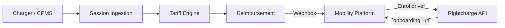

Mobility operators can reimburse drivers for home charging as part of a wider mobility service offering. This blueprint shows how to integrate Rightcharge into your mobility platform for driver enrolment, session processing, and reimbursement.

## Target outcome

Your mobility platform includes home charging reimbursement. Operators can enrol drivers, collect session data from any charger source, and process reimbursements within your existing billing and reporting workflows.

## What you own

- Mobility platform and driver app
- Vehicle allocation and scheduling
- Operator billing
- [PLACEHOLDER: webhook endpoint infrastructure]

## What Rightcharge provides

- Driver Onboarding: hosted journeys for mobility drivers
- Session Ingestion: accepts session data from any source
- Tariff Engine: electricity cost calculation
- Eligibility & Policy: qualification and fraud controls
- Reimbursement: payment calculation and records

## Required and optional modules

| Module | Required | Notes |
| --- | --- | --- |
| Driver Onboarding | Yes | Hosted journey |
| Session Ingestion | Yes | Accepts multiple sources |
| Tariff Engine | Yes | Cost calculation |
| Reimbursement | Yes | Payment records |
| Vehicle Integration | Optional | VIN-matched attribution |
| Eligibility & Policy | Optional | Rules engine |

## Architecture

Your mobility platform enrols the driver via the Rightcharge API and receives an onboarding URL. Charger or CPMS sources send sessions to Session Ingestion. The Tariff Engine and Reimbursement modules process the session, and webhooks update your platform.

## User journey

<Steps>
  <Step title="Operator adds driver">
    The mobility operator adds a driver in your platform. Your backend calls the Rightcharge API to create the driver record.
  </Step>
  <Step title="Driver receives onboarding link">
    Your platform sends the driver the onboarding URL returned by Rightcharge.
  </Step>
  <Step title="Driver completes onboarding">
    The driver enters their home charger, vehicle, and tariff details in the hosted journey.
  </Step>
  <Step title="Platform notified">
    Rightcharge sends a webhook when onboarding completes. Your platform marks the driver as active.
  </Step>
  <Step title="Driver charges at home">
    The driver plugs in. The charger or CPMS sends the session to Rightcharge.
  </Step>
  <Step title="Cost calculated">
    The Tariff Engine applies the driver's tariff and computes the electricity cost.
  </Step>
  <Step title="Reimbursement created">
    A reimbursement record is generated. Your platform receives a webhook and includes the amount in the operator's billing cycle.
  </Step>
</Steps>

## Required APIs and webhooks

| Purpose | Type | Details |
| --- | --- | --- |
| Create driver | API | [PLACEHOLDER: endpoint path for driver creation] |
| Receive onboarding URL | API | [PLACEHOLDER: response field for onboarding_url] |
| Onboarding completed | Webhook | [PLACEHOLDER: driver onboarded event name] |
| Reimbursement created | Webhook | [PLACEHOLDER: reimbursement created event name] |

## Failure and recovery paths

<Accordion title="Onboarding link expires">
  If the driver does not complete onboarding within the expiry window, your platform requests a new onboarding URL from Rightcharge.
</Accordion>

<Accordion title="Webhook not delivered">
  If your webhook endpoint is unavailable, Rightcharge retries. [PLACEHOLDER: retry count and interval] Monitor your endpoint health to avoid stale platform data.
</Accordion>

<Accordion title="Session missing tariff">
  If the driver's tariff is not yet configured, the session is held pending. Your platform can prompt the driver to complete tariff setup.
</Accordion>

<Accordion title="Eligibility rejects session">
  If the session fails eligibility, a webhook is sent with the rejection reason. Your platform can surface this to the operator.
</Accordion>

## Sandbox acceptance criteria

- [ ] Driver creation API returns a valid onboarding URL
- [ ] Hosted onboarding journey completes successfully
- [ ] Webhook received when driver onboarding completes
- [ ] Session ingestion accepts a test session
- [ ] Tariff Engine returns a cost for the test session
- [ ] Reimbursement record created and webhook received

## Go-live checklist

- [ ] Production API credentials generated
- [ ] Webhook endpoints registered and verified
- [ ] Hosted journey branding configured if applicable
- [ ] Operator billing cycle integration tested with reimbursement data
- [ ] Error monitoring for webhook delivery
- [ ] Support escalation path agreed with Rightcharge
