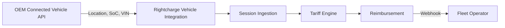

Fleet operators using your vehicles can verify home charging sessions using vehicle data and offer drivers accurate reimbursement. This blueprint shows how to connect your connected vehicle API to Rightcharge for session attribution, location verification, and reimbursement.

## Target outcome

Fleet operators using your vehicles can attribute charging sessions to the correct driver and vehicle, verify that charging occurred at home, and calculate reimbursement with confidence.

## What you own

- Connected vehicle API
- Telematics data
- OEM customer relationship
- [PLACEHOLDER: API scope for location, state of charge, and VIN data]

## What Rightcharge provides

- Vehicle Integration: OEM API connection for location, state of charge, and VIN data
- Session Ingestion: processes and stores session data
- Tariff Engine: electricity cost calculation
- Eligibility & Policy: qualification and fraud controls
- Reimbursement: payment calculation and records

<Info>
  V2G and smart charging support is a future concept. This blueprint covers session attribution and reimbursement only.
</Info>

## Required and optional modules

| Module | Required | Notes |
| --- | --- | --- |
| Vehicle Integration | Yes | OEM API for location, SoC, VIN |
| Session Ingestion | Yes | Processes session data |
| Tariff Engine | Yes | Cost calculation |
| Driver Onboarding | Optional | Hosted journey |
| Eligibility & Policy | Optional | Rules engine |
| Reimbursement | Optional | Payment records |

## Architecture

Your connected vehicle API sends location, state of charge, and VIN data to Rightcharge Vehicle Integration. Session Ingestion correlates this with charger session data. The Tariff Engine calculates cost, and Reimbursement produces a payment record. Webhooks notify the fleet operator.

## User journey

<Steps>
  <Step title="Fleet operator adds vehicle">
    The fleet operator registers the vehicle in their platform. Your system or the fleet operator authorises Rightcharge to access vehicle data.
  </Step>
  <Step title="Driver charges at home">
    The driver plugs in at home. The vehicle sends charging data to your API.
  </Step>
  <Step title="Vehicle data sent to Rightcharge">
    Rightcharge polls or receives vehicle data from your API to verify location and state of charge.
  </Step>
  <Step title="Session attributed">
    Session Ingestion correlates vehicle data with the charging session and attributes it to the correct driver and vehicle.
  </Step>
  <Step title="Cost calculated">
    The Tariff Engine applies the driver's tariff and computes the electricity cost.
  </Step>
  <Step title="Reimbursement generated">
    Reimbursement creates a payment record. The fleet operator receives a webhook.
  </Step>
</Steps>

## Required APIs and webhooks

| Purpose | Type | Details |
| --- | --- | --- |
| Vehicle data access | API | [PLACEHOLDER: endpoint path for vehicle data retrieval] |
| Authorise data sharing | API | [PLACEHOLDER: endpoint path for consent or token exchange] |
| Reimbursement status | Webhook | [PLACEHOLDER: reimbursement status event name] |
| Session attribution result | Webhook | [PLACEHOLDER: session attribution event name] |

## Failure and recovery paths

<Accordion title="Vehicle API unavailable">
  If your vehicle API is down, Rightcharge may queue requests or use cached data. [PLACEHOLDER: cache duration and fallback behaviour] Sessions may be held pending until vehicle data is available.
</Accordion>

<Accordion title="Location mismatch">
  If vehicle data indicates the vehicle was not at home during the session, Eligibility & Policy may reject the session. The fleet operator can review and override if policy allows.
</Accordion>

<Accordion title="VIN mismatch">
  If the VIN in the vehicle data does not match the registered vehicle, the session is flagged for manual review. Your system or the fleet operator must resolve the mismatch.
</Accordion>

<Accordion title="Webhook delivery fails">
  If the fleet operator's webhook endpoint is down, Rightcharge retries. [PLACEHOLDER: retry count and interval]
</Accordion>

## Sandbox acceptance criteria

- [ ] Vehicle data API returns location, SoC, and VIN for a test vehicle
- [ ] Rightcharge successfully authorises access to vehicle data
- [ ] Session ingestion accepts a test session
- [ ] Vehicle data correlates with the test session
- [ ] Tariff Engine returns a cost for the test session
- [ ] Reimbursement record created and webhook received

## Go-live checklist

- [ ] Production API credentials generated
- [ ] Data sharing consent flow tested
- [ ] Webhook endpoints registered for fleet operators
- [ ] Vehicle API rate limits documented
- [ ] Error monitoring for vehicle data sync failures
- [ ] Support escalation path agreed with Rightcharge
