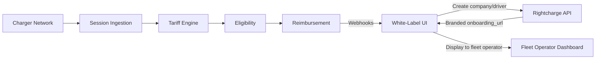

You can launch a fully branded home charging product for your fleet customers, powered by Rightcharge infrastructure. This blueprint shows how to combine all Rightcharge modules with your own brand, UI, and customer relationships to create a complete white-label offering.

## Target outcome

Your customers see a complete fleet home charging product under your brand. Drivers enrol through a branded onboarding journey, fleet managers view reports in your UI, and reimbursement events flow through your platform. Rightcharge handles the infrastructure, tariff data, and calculation engines.

## What you own

- Brand, logo, and customer-facing UI or app
- Fleet operator relationships and sales
- Payment execution
- [PLACEHOLDER: customer support and escalation processes]

## What Rightcharge provides

- All core modules: Driver Onboarding, Charger Integration, Vehicle Integration, Tariff Engine, Session Ingestion, Eligibility & Policy, Reimbursement
- Hosted onboarding journeys: brandable per partner
- Webhooks: full lifecycle events
- Energy Payments: direct supplier-to-fleet billing (limited availability)

<Info>
  Hosted journey branding (logo, colours) is configurable per partner. [PLACEHOLDER: whitelabelling configuration — contact Rightcharge].
</Info>

## Required and optional modules

| Module | Required | Notes |
| --- | --- | --- |
| Driver Onboarding | Yes | Branded hosted journey |
| Session Ingestion | Yes | Accepts multiple sources |
| Tariff Engine | Yes | Cost calculation |
| Eligibility & Policy | Yes | Rules engine |
| Reimbursement | Yes | Payment records |
| Charger Integration | Yes | Direct or CPMS |
| Vehicle Integration | Optional | VIN-matched attribution |
| Energy Payments | Optional | Direct supplier-to-fleet billing (limited availability) |

## Architecture

Your white-label UI creates companies and drivers via the Rightcharge API and receives a branded onboarding URL. Charger networks send sessions to Session Ingestion. The Tariff Engine, Eligibility, and Reimbursement modules process sessions, and webhooks feed data back to your UI for display in the fleet operator dashboard.

## User journey

<Steps>
  <Step title="Fleet operator signs up">
    The fleet operator creates an account in your white-label platform. Your backend calls the Rightcharge API to create the company record.
  </Step>
  <Step title="Fleet operator adds driver">
    The fleet operator adds a driver. Your platform calls Rightcharge and receives a branded onboarding URL.
  </Step>
  <Step title="Driver completes branded onboarding">
    The driver follows the branded onboarding journey to link their charger, vehicle, and tariff.
  </Step>
  <Step title="Platform notified">
    Rightcharge sends a webhook when onboarding completes. Your platform marks the driver as active.
  </Step>
  <Step title="Driver charges at home">
    The driver plugs in. The charger network sends the session to Rightcharge.
  </Step>
  <Step title="Cost calculated and checked">
    Rightcharge applies the tariff and eligibility rules.
  </Step>
  <Step title="Reimbursement created">
    A reimbursement record is generated. Your platform receives a webhook and displays it in the fleet operator dashboard.
  </Step>
</Steps>

## Required APIs and webhooks

| Purpose | Type | Details |
| --- | --- | --- |
| Create company | API | [PLACEHOLDER: endpoint path for company creation] |
| Create driver | API | [PLACEHOLDER: endpoint path for driver creation] |
| Receive branded onboarding URL | API | [PLACEHOLDER: response field for onboarding_url] |
| Onboarding completed | Webhook | [PLACEHOLDER: driver onboarded event name] |
| Reimbursement created | Webhook | [PLACEHOLDER: reimbursement created event name] |
| Session status | Webhook | [PLACEHOLDER: session status event name] |
| Company status | Webhook | [PLACEHOLDER: company status event name] |

## Failure and recovery paths

<Accordion title="Onboarding link expires">
  If the driver does not complete onboarding within the expiry window, your platform requests a new onboarding URL from Rightcharge.
</Accordion>

<Accordion title="Webhook not delivered">
  If your webhook endpoint is unavailable, Rightcharge retries. [PLACEHOLDER: retry count and interval] Monitor your endpoint health to avoid stale dashboard data.
</Accordion>

<Accordion title="Branding misconfiguration">
  If the branded journey does not display correctly, verify your whitelabelling settings with Rightcharge. [PLACEHOLDER: whitelabelling configuration contact]
</Accordion>

<Accordion title="Session missing tariff">
  If the driver's tariff is not configured, the session is held pending. Your platform can prompt the driver to complete tariff setup.
</Accordion>

<Accordion title="Eligibility rejects session">
  If the session fails eligibility, a webhook is sent with the rejection reason. Your platform can surface this to the fleet operator.
</Accordion>

## Sandbox acceptance criteria

- [ ] Company creation API succeeds
- [ ] Driver creation API returns a valid branded onboarding URL
- [ ] Hosted onboarding journey displays correct branding
- [ ] Webhook received when driver onboarding completes
- [ ] Session ingestion accepts a test session
- [ ] Tariff Engine returns a cost for the test session
- [ ] Reimbursement record created and webhook received
- [ ] Fleet operator dashboard displays reimbursement data correctly

## Go-live checklist

- [ ] Production API credentials generated
- [ ] Webhook endpoints registered and verified
- [ ] Branded onboarding journey approved by your design team
- [ ] Whitelabelling configuration confirmed with Rightcharge
- [ ] Fleet operator roles and permissions mapped
- [ ] Error monitoring for webhook delivery and API failures
- [ ] Customer support runbook documented
- [ ] Support escalation path agreed with Rightcharge
