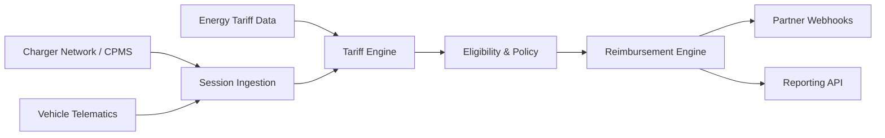

The Rightcharge platform is built as a set of composable modules that ingest data from external sources, apply business logic, and expose results to you through APIs, webhooks, and hosted journeys. This page describes the high-level topology, how data flows through the system, and where your responsibilities begin and end.

## Module topology

The architecture is organised into three layers:

1. **Data sources** — external systems that supply raw data. These include charger networks and CPMS platforms, vehicle telematics services, and energy tariff data providers.
2. **Rightcharge modules** — the core platform components that process and transform data. Session ingestion normalises charging records; the tariff engine calculates costs; the eligibility and policy engine applies rules; and the reimbursement engine generates payment amounts.
3. **Partner surface** — the interfaces you consume. REST APIs for programmatic access, webhooks for event-driven integrations, and hosted journeys for ready-made user flows.

## Integration boundaries

Rightcharge owns the infrastructure, data integrations, and calculation logic. You own the customer-facing experience, fleet management rules, and payment disbursement where applicable.

| Rightcharge owns | Partner owns |
| --- | --- |
| Charger network and CPMS integrations | Driver-facing UI and branding |
| Vehicle telematics and OEM integrations | Fleet management rules and workflows |
| Energy tariff data sourcing and maintenance | Payment disbursement to drivers (where applicable) |
| Session ingestion, storage, and normalisation | Customer support and driver communications |
| Tariff cost calculation logic | Policy configuration (eligibility rules) |
| Reimbursement calculation and reporting | Go-live timing and commercial terms |

<Note>
  Rightcharge does not hold funds or execute bank transfers. Where reimbursement involves actual money movement, you or a designated payment provider handle disbursement.
</Note>

## Data residency

[PLACEHOLDER: data residency regions — engineering to provide]

Rightcharge processes and stores data in accordance with the regions configured for your account. If you have specific data residency requirements, contact Rightcharge during onboarding to confirm availability.
