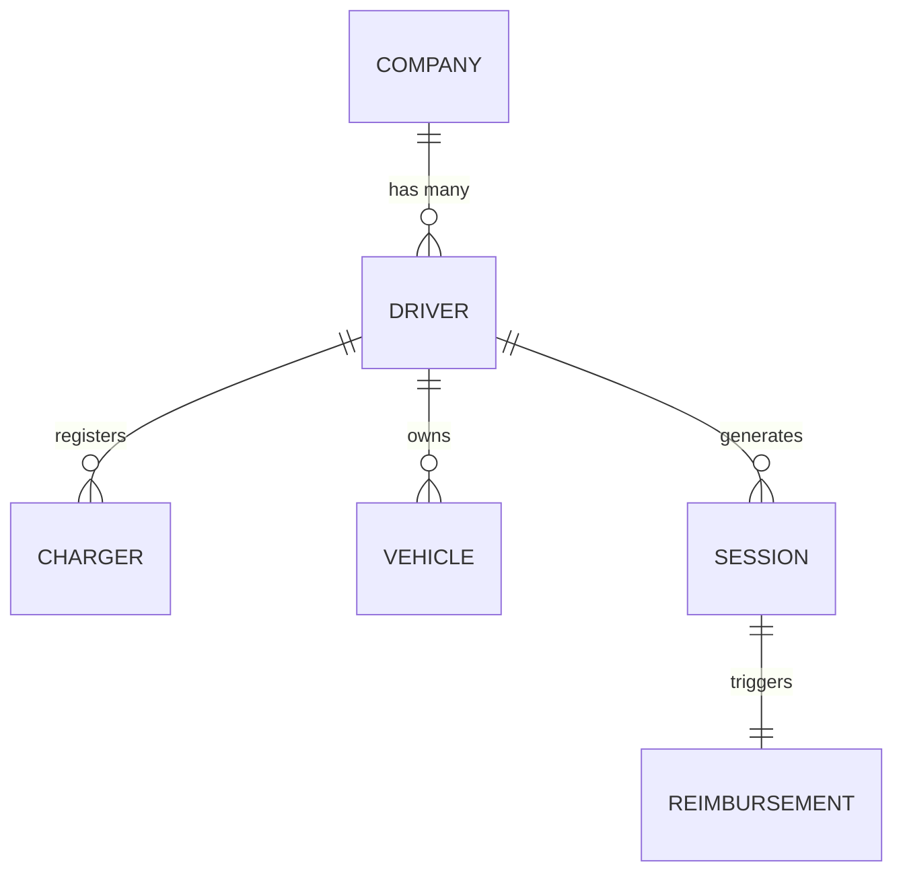

The Rightcharge data model is built around six core resources. Understanding how they connect helps you design your integration, map your existing user records, and interpret API responses and webhook payloads correctly.

## Core resources

- **Company**: the fleet or business entity. This is the top-level object in the hierarchy. A company has many drivers and defines the billing and policy context for its fleet.
- **Driver**: an individual belonging to a company. A driver moves through an onboarding state, can register one or more chargers, and owns one or more vehicles.
- **Charger**: a home charging device registered to a driver. Each charger is linked to a CPMS or charger manufacturer integration so session data can be ingested automatically.
- **Vehicle**: a driver's EV. Vehicles are used for session attribution, eligibility checks, and smart charging identification.
- **Session**: a charging session recorded for a driver. It contains start and end timestamps, energy delivered in kWh, and the charger used. Sessions are the basis for reimbursement calculation.
- **Reimbursement**: the calculated amount owed to a driver or supplier for one or more sessions. A reimbursement is produced after the tariff engine and eligibility policy have been applied.

## Entity relationships



A company contains many drivers. Each driver can register multiple chargers and own multiple vehicles. Charging sessions are generated by a driver and, once processed, typically trigger a single reimbursement.

## Identifiers

All resources use opaque string IDs assigned by Rightcharge. You may supply an `external_id` on companies and drivers to map them directly to records in your own system. This makes reconciliation and webhook handling simpler, because you can match events using your own identifiers rather than storing Rightcharge IDs separately.

## Timestamps

All timestamps in the Rightcharge API are ISO 8601 formatted and expressed in UTC. When you submit session data, provide start and end times in UTC. API responses and webhook payloads always return UTC timestamps.

```json
{
  "id": "sess_abc123",
  "driver_id": "drv_def456",
  "started_at": "2024-01-15T18:30:00Z",
  "ended_at": "2024-01-15T22:45:00Z"
}
```
